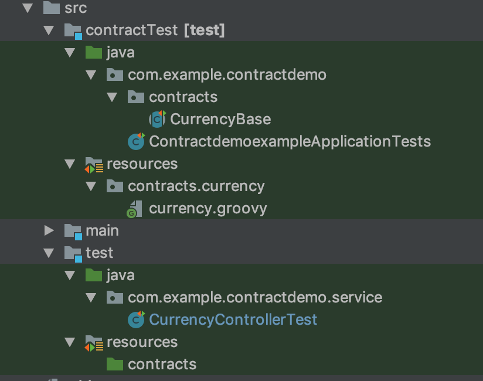
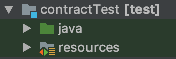
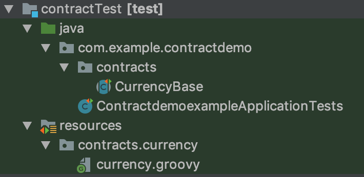
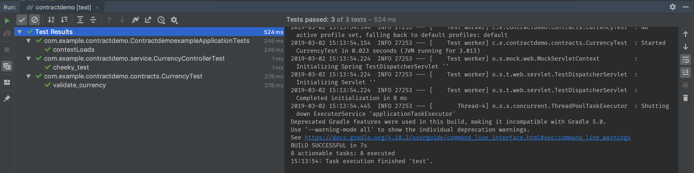

# Creating separate space for Spring cloud contracts
Recently I was working on a Spring Cloud Contracts project and I really wanted to separate the tests out from the test folder. The reason is that when I develop I prefer to create a new folder for each type of tests that I run. This typically is:
   * test -> unit tests
   * integrationTest -> integration tests
   * performanceTest -> performance tests
and now I want
   * contractTest -> contract tests

Typically the process involves the configuration of a new source set for each of the test types. Originally the plan was to create a new contractTest sourceSet configuration which would have totally separated the contract tests from the test source set that is configured by default. The use of the test source set works well in small and simple project and for demonstrating the setup of Spring Cloud Contracts which is what every tutorial I found.

I was unable to set the contract tests in their own configuration as when looking in the gradle plugin it registers itself to the `compileTestJava` task which is part if the gradle Java plugin lifecyle.

```project.tasks.findByName("compileTestJava").dependsOn(task)```

This is not configurable and so the the simplest way to separate was to create a new folder and add this to the test source and resource directories

## Show me the setup!

The outcome is the following:



### The Spring Cloud Contracts plugin setup

The build.gradle for this project can be see in the sample project located here: https://my.github.com/.
This post will not go into the setup of Spring Cloud Contracts as others do this much better and we concentrate on how to split the contracts code into their own folder.

The first part is to create the new contract test folder which in this case was called `contractTest` and to follow the same structure that is typically used a sub folder `java` and `resources` was also added.



These new sources then needed to be added to the test source set:

```Gradle
sourceSets {
    test {
        java {
            srcDir 'src/test/java'
            srcDir 'src/contractTest/java'
        }
        resources {
            srcDir 'src/test/resources'
            srcDir 'src/contractTest/resources'
        }
    }
}
```

As we want to put our contracts and our base contract tests packages in this folder this was then configured in the gradle contracts plugin

```Gradle
contracts {
    packageWithBaseClasses = 'com.example.contractdemo.contracts'
    contractsDslDir = new File("${project.rootDir}/src/contractTest/resources/contracts/")
}
```

The final result is that the contracts and the base classes can be added to this folder like so:



When the Gradle test take `gradle test` the changes are picked up and the tests are ran

