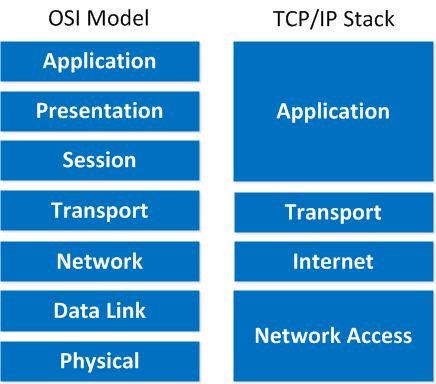

# Notes on RSocket

The RSocket website is http://rsocket.io 

RSocket is an application level binary protocol. Quote *"RSocket is an OSI Layer 5/6, or TCP/IP “Application Layer” protocol."*

HTTP, SSH, FTP, POP3, WebSockets are examples of the Application layer
TCP, UDP, SCTP, Aeron are  in the transport layer examples

## Interaction models
RSocket has four interaction models
   * Fire and Forget -> Send message, used for lossy messages
   * Request/Response -> Send Request, Response of single stream
   * Request/Stream -> Send Request, Response is a stream
   * Channel -> Bi-Directional communication of streams

## Sessions
RSocket supports session resumption:

***"It supports session resumption, to allow resuming long-lived streams across different transport connections"***

## Multiplexed communication
Multiplexed communication is when you send have a single socket to communicate, however, you have multiple streams that send data along the socket. RSocket supports this and partitions the connection into logical streams by annotating each message with a streamID

The messages that are sent across the stream and then sent along the connection with their stream id's. The other end reads the stream id to put the message into the correct stream on the other end

## Fragmentation
Message fragmantation is a first class citizen. Fragmentation of messages is the splitting up of the payloads into frames.

An example is let us say the client requested to receive an episode of Game of Thrones. This could be sent as a single payload, however, instead of buffering up an entire episode and sending at once it is better to split the payload into frames and send smaller sizes down the wire. This is then re-constructed on the receiver's side

## MetaData in the Payload
RSocket has metadata built in as part of the payload. This is really useful as if we open an channel we may send different types of data down the wire. We can send JSON, video, PNG's, etc. It is really useful to declare the MIME type of the message to decode it correctly.

## Cancellation
This is built into the protocol. If a request is made and it is very long running e.g. find the address of everyone that has the letter J in their name, and then the requester decides they do not care any more or they have found what they want e.g. the 500th name with J in it was what was wanted. The requester can issue an cancel that will inform the servicor of the request that they can cancel the operations associated and stop performing the task.
A cancellation is sent as a Cancellation Frame from the requester

## Application flow control
Reactive Stream (pull-push) back pressure is built into the protocol.
### request(n) Async Pull
Ensues the requester does not get overwhelmed with data

### Leasing
Ensures that the producer does not get overwhelmed with chatty requests

## Does this mean creating stateful micro services?
No it does not as the requester asks for a stream and the producer will send back the responses. It buffers up the responses and sends them back in like you would in a normal REST API. If we take the example of a database query then in both cases they take a few seconds to query the DB and send back a response. They both have state for as long as the connection lasts.
You can of course have state in your request such a continuous query to a database that is continually updated
The core thing to remember is that there is no state implied by the RSocket protocol

# [Reactive Programming] fundamentals (based on project Reactor)

### Reactive model
Reactive streams are **push** based which is different from the [iterator design pattern] which is **pull** based (think about it as pulling items off a collection).

The reactive streams programming pattern is the [Publish-Subscribe] pattern. The publisher notifies the subscriber of newly available values as they come.

### Why write reactive code
By writing Reactive code (asynchronous, non-blocking code) you write more efficient code as you can switch to other active tasks using the same underlying resources and return to tasks once the asynchronous task has completed.

In Java we have two models for async programming:
   * [Callbacks]
   * [Futures]

Reactive programming helps to solve these downsides of using these two models using the publish subscribe model

### Subscribing to a stream
In Reactive programming nothing happens until you subscribe to the publisher (this seems similar to [Java streams] that the stream is lazy and only starts when you add a terminal operation to it)

There are two types of subscription:
   * Cold - A Cold sequence starts anew for each Subscriber, including at the source of data. For example if the source wraps an HTTP call, a new HTTP request is made for each subscription
   * Hot - A Hot sequence does not start from scratch for each Subscriber. Rather, late subscribers receive signals emitted after they subscribed.

For further information check the Hot Vs Cold docs in Project Reactor https://projectreactor.io/docs/core/release/reference/index.html#reactor.hotCold

### Streams
   * Flux -> 0 to N elements 
   * Mono -> 0 to 1 elements

Errors are first class citizens and a steam will one of the three interfaces
   * onNext 
   * onError - Terminal event, not required but heavily suggested
   * onComplete - Terminal event, not required

onError and onComplete are exclusive of each other

#### Hooks for streams
It is possible to add hooks to streams for events such as onSubscribe, onError, onCancel

### Creating a generator
To create a generator of a Flux you can use a few different methods. This is useful if you want to listen to messages off a queue or create a Flux based off some Aysnc behaviour.

More information about Reactive generators from Project Reactor can be found here: https://projectreactor.io/docs/core/release/reference/index.html#producing

The key sinks to note are
   * SynchronousSink - synchronous and one-by-one emissions
   * FluxSink - multiple emissions per round

This gets us to a Push/Pull model where the we follow a Push model, however, there is a small part that is pull based. We need to consume from a source and in that sense will not emit anything until requested (onSubscribe)

[Reactive Programming]: https://en.wikipedia.org/wiki/Reactive_programming
[iterator design pattern]: (https://en.wikipedia.org/wiki/Iterator_pattern)
[Publish-Subscribe]: (https://en.wikipedia.org/wiki/Publish–subscribe_pattern)
[Callbacks]: (https://en.wikipedia.org/wiki/Callback_%28computer_programming%29)
[Futures]: (https://en.wikipedia.org/wiki/Futures_and_promises)
[Java streams]: (https://docs.oracle.com/javase/8/docs/api/java/util/stream/Stream.html)
[Project Reactor docs]: (https://projectreactor.io/docs/core/release/reference/index.html)
