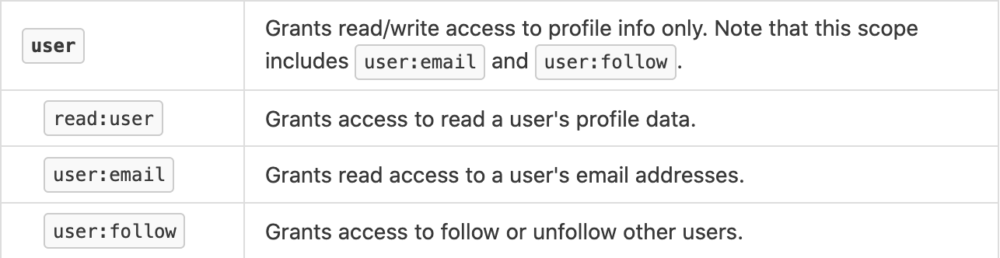
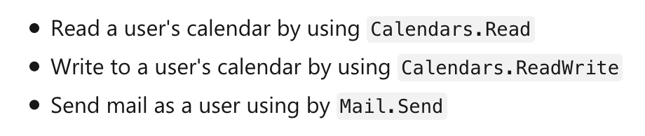

# OAuth2 Scope design and what best practice

In this document we will use discussing API Scopes. It is assumed that the reader is familiar with OAuth2. It is key to understand the fundamentals of OAuth2 to make use out of this document.

## What are OAuth2 Scopes?
Firstly what are OAuth2 Scopes? The [OAuth2 Spec section 3.3](https://tools.ietf.org/html/rfc6749#section-3.3) defines in full what a scope is and the grammar of sending a scope request when requesting an OAuth2 Access token. However, the key takeaway from this section is that it allows the `"client to specify the scope of the access request"`.

This can be read as allowing an OAuth 2 Client to be more fine grained with the types of request that they wish to make. Another point from the specification is that a scopes are optional.

This interpretation of a Scope has been arrived at from the material provided. What do others say about them?

### Microsoft on Scopes
Microsoft describe scopes as the following. It is important to note the Microsoft call Scopes, `permissions`.

> [A third-party app can request these permissions from users and administrators, who must approve the request before the app can access data or act on a user's behalf. By chunking the resource's functionality into smaller permission sets, third-party apps can be built to request only the specific permissions that they need to perform their function](https://docs.microsoft.com/en-us/azure/active-directory/develop/v2-permissions-and-consent#scopes-and-permissions)

### Okta on Scopes
Okta, one of the leading identity providers and they sponsor oauth.net and oauth.com. As Okta support both these sites and we shall refer to the documentation that is produced as the same source i.e. Okta. One core statement out of the definition from oauth.net is

> [Scope is a mechanism in OAuth 2.0 to limit an application's access to a user's account. An application can request one or more scopes, this information is then presented to the user in the consent screen](https://oauth.net/2/scope/)

From oauth.com

> [Scope is a way to limit an app’s access to a user’s data. Rather than granting complete access to a user’s account, it is often useful to give apps a way to request a more limited scope of what they are allowed to do on behalf of a user.](https://www.oauth.com/oauth2-servers/scope/)

### Github on Scopes
Github have had an API for a long time and is incredibly popular. They have created a developer page for developers to understand OAuth Scopes which can be found [here](https://developer.github.com/apps/building-oauth-apps/understanding-scopes-for-oauth-apps/)

> Scopes let you specify exactly what type of access you need. Scopes limit access for OAuth tokens. They do not grant any additional permission beyond that which the user already has.

This summary of a scope is very much aimed at limiting the abilities of an Access Token

### HMRC on Scopes
HMRC are an interesting body to look at. They provide a large API offering that covers a wide range of services. They appear very API centrirc and the API offering looks well thought out. Being such a crucial service for UK Government it would be assumed that a lot of thought has gone into its design, especially for developer interaction.

The [documentation](https://developer.service.hmrc.gov.uk/api-documentation/docs/reference-guide) that is provided classes scopes as the following

> Each 'scope' relates to one or more endpoints.
> 
> When your application requests an OAuth 2.0 Bearer token, it must specify the scope(s) which the token should be granted for.
> 
> These are translated to human-readable descriptions that are shown to the user before they grant authority. This makes sure the user understands and gives access to your application.

HMRC's focus is on the End User and the relationship to the endpoint rather than the limitation of the an access token. This plays to the theme that HRMC's APIs require a scope and a default is not provided

### Fitbit on Scopes
Fitbit have a single purpose which is health data. Their definition of a scope is 

> [Applications must only request permission for resources they intend to access or modify. OAuth 2.0 refers to these permissions as scopes. All Fitbit API endpoints require one or more scopes](https://dev.fitbit.com/build/reference/web-api/oauth2/#scope)

Fitbit like Microsoft go with the interchangeable term `permission`. Also they mandate that a scope MUST be defined.

### Slack on Scopes
Slack has a large amount of scopes defined and has an interesting model as the predominate use of OAuth with Slack is with Bots. The OAuth2 Scope description can be found [here](https://api.slack.com/docs/oauth-scopes) and there are a couple interesting  points raised

> OAuth scopes let you specify exactly how your app needs to access a Slack user's account

> Slack's system of OAuth permission scopes governs usage of Slack Apps

Slack uses the term of permission and scope as if they are the same and again define the scope from a user perspective

### Summary of what is a Scope

These descriptions from all these major players in the API space have descriptions that overlap. However we can confirm that there is no consistent definition.

We shall define a Scope as the following:

> A Scope lets a Client specify the Resources they intend to access. The Scope or Scopes that is requested may be the Set or a Subset of all available Resources.

#### Are Scopes the same as Permissions?
Having the term Permission and Scope put together is really interesting as this is not specified in the OAuth2. It would appear that this is not an ideal scenario as a Scope is defining a set of resources that are going to be accessed. A permission can be considered if the delegated access is allowed or not. Though they cross over they are not equal.

## Why do care about design
After all the investigation why do we care about Scope design? Scopes as we have defined imply that Resources must be in groups or a single group. This grouping is used by the Client and as this is Client facing the designer of these Scopes must make it logical for them to understand the design and what the Scope does. As Scopes are not something that are traditionally versioned (this is subject for another day) and remain the same for the lifetime of the API offering it is important to get the design correct. Asking Clients to start using new Scope names or even to start using a Scope must be communicated and a migration path created. If you look at Github's Scope names you can see some inconsistences are they are consolidating an initial poor design

This example shows that the `read:user` is under the `user` scope.

## What do other companies do regarding Scope design

The closest thing to a design document is by OAuth.com who state the [read/readwrite](https://www.oauth.com/oauth2-servers/scope/defining-scopes/) pattern as a good place to start. The definition goes on to describe that too many Scopes are bad and confusing for the Client by creating too many. What is not raised in this document is a pattern that should be used along with read/readwrite.

Slack describe their pattern and they use Actions
> Slack uses scopes that refer to the object they grant access to, followed by the class of actions on that object they allow (e.g. file:write)

Actions that are available are `read`, `write` and `history`.

This structure is different from read/readwrite, however, for the service that Slack provide this works for them. They do not have a strictly read, write model that others have.
The objects that they mention are not defined, though by looking at them you can interpret them as functionality

Though Github have not defined a design or patten they have presenting the use of [normalized scopes](https://developer.github.com/apps/building-oauth-apps/understanding-scopes-for-oauth-apps/#normalized-scopes). This is a very interesting as causes the Client developer to know about this and know the hierarchy of the scopes Github has defined. The OAuth2 spec states it is fine to return different scopes to those requested. However, from a Client usage point of view this difference is something that they need to be aware of.

With all of the bodies analysed what can be extracted is that there is always a functionality defined. Github have `user` as a scope which is just a call of functionality. Slack define the functionality followed by an action `users.profile:read` and `users.profile:write`. Again to reiterate all of the bodies have a functionality

### read/readwrite VS action
What is the difference between these definitions?

read/readwrite could be thought of as CRUD
   * read - Read
   * readwrite - Create Read Update Delete

Action is very open ended. Microsoft use Actions as well and you can see a combination of applicable actions to the resource functionality.

From the image we see the `Calendars.Read`, `Calendars.ReadWrite` and `Mail.Send`. The Action of Mail.Send is the valuable Action Scope and is valuable as you Send an email. Though you can Write a mail it does not imply you can Send a mail and also Send makes more sense as an Action.

As Microsoft use `Read` and `ReadWrite` along with `Send` we can say that `Read` and `ReadWrite` are both Actions and that the read/readwrite pattern is the use of two exclusive Actions

### Summary of Scope designs
No Scope design documents appeared from these bodies, though again we can extract some key points.
   * Functionality always appear
   * Actions are NOT always applied to these analysed bodies

## Suggested scope design
This document has steered away from suggesting how to separate the functionality or what Actions are best for the functionality.

However, a pattern can be suggested which is:

\[Functionality]\[Delimiter]\[Action]

* Functionality - The business resource functionality. Examples include Calendar, User, Search. Suggested CamelCaps
* Delimiter - A delimiter to separate the Functionality from the action. Suggested delimeter is `:` or `.`
* Action - The ability the Client would like to access. This should be either `Read/ReadWrite` or an applicable interaction. Examples of applicable interaction is `Send`, `Share`, `Select`. Suggested CamelCaps

This pattern is simple, however, what this does achieve is an understandable consistent pattern that a Client can wrap their head around quickly. This clean pattern also has an additional benefit that as an API Manager it is simple to see what Clients are requesting and quickly establish what they want access too. This is a benefit for analyzing Clients and understanding their usage.

### Should scopes cross over
This is a topic has not appeared in any of the material conducted as part of this research. This is a design choice as there is no reason this could not be implemented. However, this is strongly discouraged as it is likely it would lead to confusion for the Client.

## Overview of document
In this document we analyse the use of Scopes by various companies. There are crossovers in the Scope designs throughout, however, no consistent approach or pattern between them. Also there is no description of how the design that is being used was arrived at.

We establish a simple pattern that would appear to work for all the bodies that were analysed and would be suggestible if an API Designer was looking to create an API offering.
